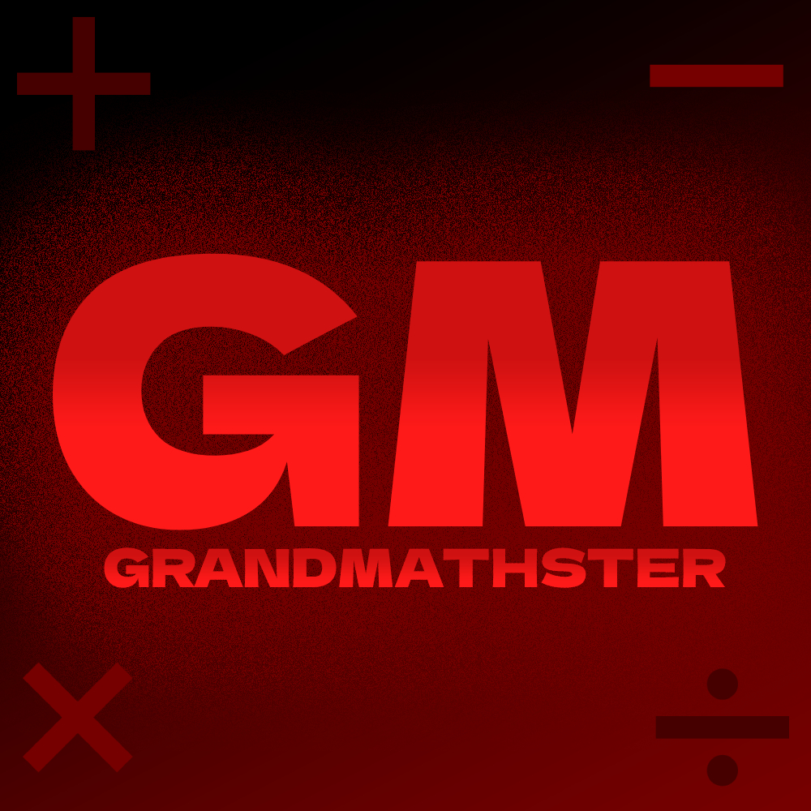

<!-- 
NOTE: do nvm use 16.17.0, then npm start to run this app correctly
bugfixes todo -
- addition hard mode - not aligning properly on ipad (swap first and second num?)
- ... -->
<!-- 
- force portait view
- add names to footer and about section 
- -->

<!-- Solution with regex -->
<!-- const [fieldInput, setFieldInput] = useState('')

onChangeText = {(input) => {
                    const changeText = (input) => {
                      let newText = input.replace(/[^0-9]+/, '')
                      setFieldInput(newText)
                    }
                    changeText(input)
                  }}
                  value={fieldInput} -->

<!-- HEADER -->
<h1 align="center">
   
  <a href="https://apps.apple.com/us/app/grandmathster/id1668216288">🔗 Available on iOS</a>
</h1>

<!-- BADGES -->

&nbsp;
&nbsp;

<!-- BRIEF DESCRIPTION -->

An educational gaming app designed to help both young and old sharpen their mental math abilities. Complete each game mode and become a <b style="color:#B8100F">Grandmathster</b> with our simple and fun ways of practicing these essential skills.

<!-- TABLE OF CONTENTS -->
  

  <b>Table of Contents</b>
  

  <ol>
    <li>
      <a href="#overview">Overview</a>
    </li>
    <li>
      <a href="#installation">Installation</a>
    </li>
    <li><a href="#playing-the-game">Playing the Game</a></li>
    <li><a href="#contact">Contact</a></li>
  </ol>

### Overview

#### About the game

With mental math still being an important part of children's formative education, we wanted to build an app that would mainly help these younger groups of people become more engaged with the subject and flourish in class as a result.

Grandmathster gives players the choice of answering questions on addition, subtraction, multiplication or division. Within this simple interface, the app allows different levels of customization to each game mode - such as the option to select your desired number of questions to solve or to focus on specific digits only (e.g. exclusively working on multiples of 7). Additionally, players are able to keep track of their top scores and unlock different badges throughout the game.

As the skills developed by playing are also useful in different working fields, the game can also be enjoyed by adults. A more detailed view on using the app, with in-game examples, is provided in the 'Playing the game' section below.

#### Technology Stack

[![ReactNative][ReactNative]][ReactNative-url]  [![Expo][Expo]][Expo-url]

Grandmathster was written in React Native and made use of Expo for building, testing, and deploying purposes.

We are excited to present Grandmathster to you and hope it improves your mathematical skills. Enjoy!

### Installation

Grandmathster is available from the app store at the following URL:  
<a href="https://apps.apple.com/us/app/grandmathster/id1668216288">https://apps.apple.com/us/app/grandmathster/id1668216288</a>

The app is free to download and is compatible with iOS devices (iPhone and iPads)

### Playing the game

This app has been designed with simplicity in mind and is easy enough for anyone learning basic math to instantly get used to. As such, navigating Grandmathster is largely self-explanatory and just requires picking a game mode and difficulty level to get started. Some of the gameplay and additional features are demonstrated below:
 

<!-- Screen Capture: Customizable gameplay -->

<b>Customizable Gameplay</b>

Grandmathster allows players to control their own games so they can get comfortable on areas of weakness

 

<!-- Screen Capture: Math Tips -->

<b>Math Tips</b>

Players can access additional information about the app as well as useful math tips from any page, including during an active game

 

<!-- Screen Capture: Rankings -->

<b>Rankings</b>

Players receive custom ranks at the end of each game. Achieving 100% accuracy on selected modes earns the Grandmathster rank

 

<!-- Screen Capture: Scores & Badges -->

<b>Scores & Badges</b>

Players can view the badges they have unlocked and see their best time attack scores by game mode

### Contact

If you are interested in reporting any issues, would like to ask further questions about this project or would just like to connect with us, you may contact the team directly at:

**Bilal Abbas**
| [linkedin.com/in/babbasuk](https://linkedin.com/in/babbasuk) | [github.com/B-Abbas](https://github.com/B-Abbas) |

**Bill Munkacsy**
| [linkedin.com/in/williammunkacsy](https://linkedin.com/in/williammunkacsy) | [github.com/BillMun](https://github.com/BillMun) |

<!-- VARS -->

[ReactNative]: https://img.shields.io/badge/react_native-%2320232a.svg?style=for-the-badge&logo=react&logoColor=%2361DAFB
[ReactNative-url]: https://reactnative.dev/

[Expo]: https://img.shields.io/badge/expo-1C1E24?style=for-the-badge&logo=expo&logoColor=#D04A37
[Expo-url]: https://expo.dev/
